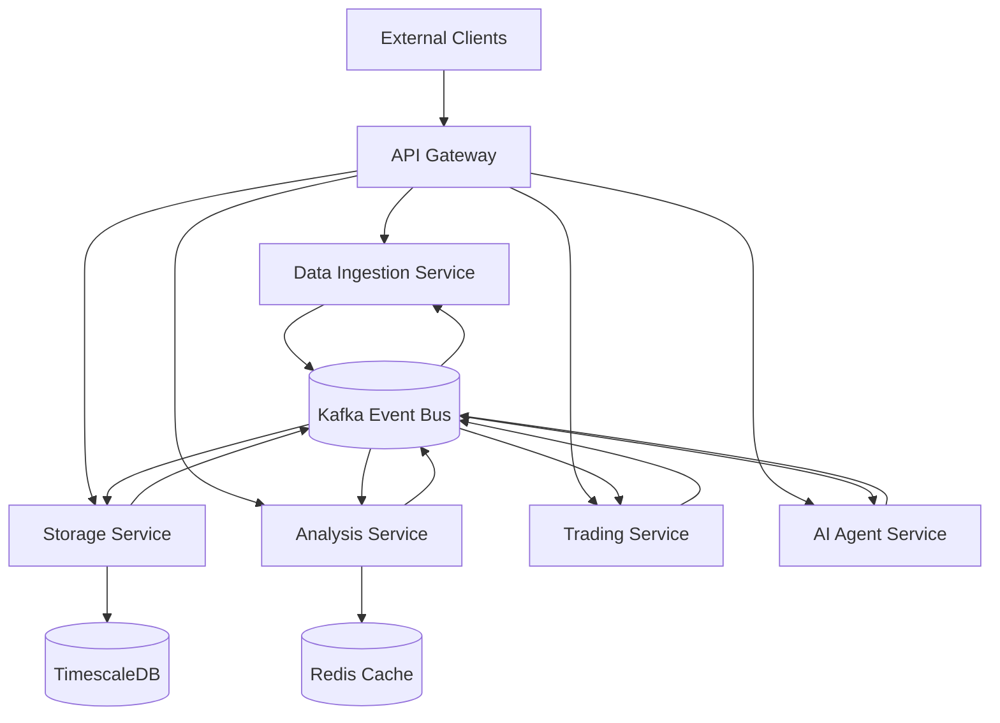

# QuantFlow Microservices Architecture

## Overview

The QuantFlow platform has been enhanced with a microservices architecture to improve scalability, maintainability, and fault tolerance. This architecture decomposes the monolithic application into specialized services that communicate through an event-driven system.

## Architecture Diagram



## Services

### 1. Data Ingestion Service (Port 3001)
- Responsible for collecting real-time market data from exchanges
- Connects to WebSocket APIs of cryptocurrency exchanges
- Publishes market data events to the event bus
- Supports multiple exchange integrations

### 2. Storage Service (Port 3002)
- Manages persistent storage of market data
- Uses TimescaleDB for time-series data optimization
- Provides APIs for data retrieval and historical analysis
- Implements data retention policies

### 3. Analysis Service (Port 3003)
- Performs technical analysis on market data
- Calculates indicators (RSI, SMA, volatility, etc.)
- Conducts correlation analysis between assets
- Generates analytical insights and publishes them

### 4. Trading Service (Port 3004)
- Manages trading positions and portfolio
- Executes trades based on signals
- Implements risk management rules
- Tracks performance metrics

### 5. AI Agent Service (Port 3005)
- Orchestrates the entire system using machine learning
- Implements advanced ML models (LSTM, reinforcement learning)
- Makes intelligent trading decisions
- Continuously learns from market outcomes

### 6. API Gateway (Port 3000)
- Routes requests to appropriate services
- Provides a unified entry point for clients
- Implements rate limiting and authentication
- Aggregates responses from multiple services

## Event-Driven Communication

The system uses Apache Kafka as the event bus for asynchronous communication between services:

- `market-data`: Real-time price and volume data
- `analysis-results`: Technical indicators and analytical insights
- `trade-execution`: Trade execution events
- `ai-decisions`: AI-generated trading decisions

## Scalability Features

### Horizontal Scaling
- Each service can be scaled independently based on demand
- Load balancing across multiple instances
- Stateful services (like Storage) use external databases

### Database Sharding
- TimescaleDB hypertables for time-series data optimization
- Automatic partitioning based on time intervals
- Efficient querying of large historical datasets

### Caching Strategy
- Redis caching for frequently accessed data
- Cache invalidation strategies
- Performance optimization for read-heavy operations

## Deployment

### Docker Compose
The entire system can be deployed using Docker Compose:

```bash
docker-compose up -d
```

### Kubernetes (Future Enhancement)
- Helm charts for Kubernetes deployment
- Service discovery and load balancing
- Auto-scaling based on metrics
- Rolling updates and rollbacks

## AI Agent Capabilities

The AI Agent service implements several advanced machine learning capabilities:

### Deep Learning Models
- LSTM networks for price prediction
- Transformer models for pattern recognition
- CNN for feature extraction from order book data

### Reinforcement Learning
- Q-learning algorithms for optimal trading strategies
- Policy gradient methods for continuous action spaces
- Multi-agent systems for portfolio optimization

### Feature Engineering
- Technical indicators (RSI, MACD, Bollinger Bands)
- Sentiment analysis from news and social media
- Economic indicators integration
- Cross-asset correlation analysis

### Online Learning
- Continuous model adaptation to changing market conditions
- Transfer learning between different market regimes
- Ensemble methods combining multiple models

## Service Mesh Implementation

For production deployments, a service mesh (like Istio) can be implemented to provide:

- Traffic management and routing
- Security policies and encryption
- Observability and monitoring
- Resilience patterns (retry, timeout, circuit breaker)

## Load Balancing and Failover

- NGINX or HAProxy for load balancing
- Health checks for service availability
- Automatic failover mechanisms
- Graceful degradation during partial outages

## Monitoring and Observability

- Prometheus for metrics collection
- Grafana for dashboard visualization
- ELK stack for log aggregation
- Distributed tracing with Jaeger

## Security

- Mutual TLS authentication between services
- OAuth2 for API authentication
- Role-based access control (RBAC)
- Data encryption at rest and in transit